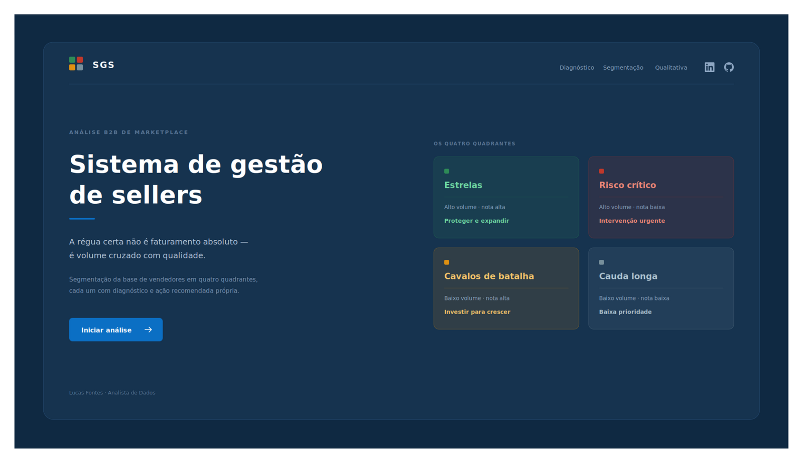
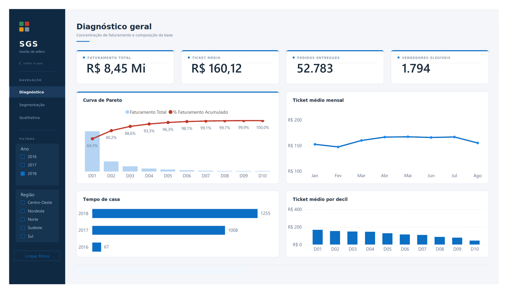
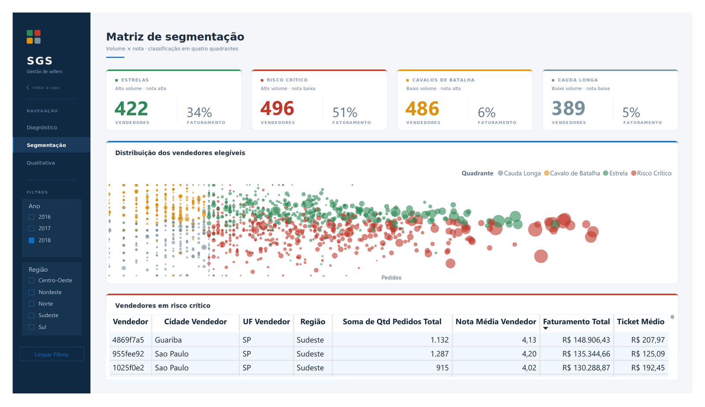
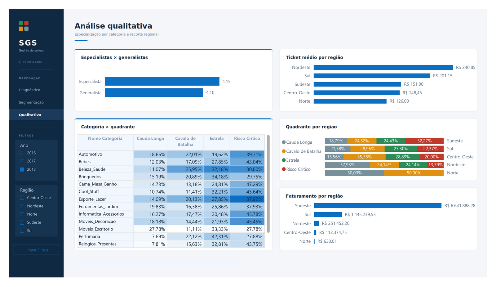

# Sistema de Gestão de Sellers (SGS)

Segmentação da base de vendedores do marketplace Olist em quatro quadrantes acionáveis, cruzando volume de pedidos com nota de avaliação.

**[Ver o dashboard ao vivo](https://app.powerbi.com/view?r=eyJrIjoiM2YzNzc1ZjctZmYzYy00ZjdlLWExNWUtYzZiYTFiZTE5Yjc5IiwidCI6ImU4MmU1OWEwLWY0YTAtNDNmMC1iM2E5LTIwMDZjNjdmMGQ2NiJ9)**

---
 
## 🎥 Preview
 
| Capa | Diagnóstico Geral |
|:---:|:---:|
|  |  |
| **Matriz de Segmentação** | **Análise Qualitativa** |
|  |  |
 
📄 [Ver as quatro páginas em PDF](assets/SGS-Dashboard.pdf)
 
> As capturas foram exportadas com o filtro de ano em 2018. Os números citados neste README e na documentação são do período completo — setembro de 2016 a outubro de 2018.
 
---

## Principais achados

**Quem mais fatura por vendedor não são as Estrelas — é o Risco Crítico.**

Os 496 vendedores com alto volume e nota abaixo da mediana faturam em média R$ 16,2 mil cada. As 422 Estrelas, com volume e nota altos, faturam R$ 13,2 mil. Se a Olist ranquear a base por faturamento, esses 496 aparecem no topo da lista — são os melhores pelo critério errado, e concentram 52% de toda a receita rodando com avaliação ruim.

**A concentração de receita supera o padrão 80/20.**

Os 10% maiores vendedores respondem por 67,2% do faturamento. Os 20% maiores, por 82,5%. E a metade inferior da base — 1.485 vendedores — movimenta 3,2%. A régua do faturamento absoluto não separa nada: quase todo mundo está na cauda.

**Duas hipóteses que eu tinha, e os dados derrubaram.**

Achei que vendedor especialista teria nota melhor que generalista. Deu 4,15 contra 4,10 — diferença dentro do ruído. Achei que existiria diferença regional de qualidade. A nota varia de 4,20 a 4,00 entre as cinco regiões, enquanto o faturamento varia 26 vezes. Geografia explica volume, não qualidade.

**O problema se concentra em categorias específicas.**

Cama_Mesa_Banho tem 47,3% dos vendedores em Risco Crítico. Informática_Acessórios, 45,8%. Móveis_Escritório, 27,8%. Quando a concentração é tão desigual entre segmentos, o problema deixa de ser do vendedor individual e passa a ser estrutural da categoria — o que muda completamente a ação recomendada.

---

## Contexto

O marketplace da Olist não tem um critério explícito de gestão de base. A régua natural é faturamento: quem vende mais é bom, quem vende menos é irrelevante.

Esse critério tem um problema. Ele não enxerga qualidade. Um vendedor pode faturar muito e destruir a reputação da plataforma, e pela régua do faturamento ele aparece como caso de sucesso.

A tese deste projeto é que a régua correta é **volume cruzado com nota**. Isso produz quatro grupos, cada um com um diagnóstico e uma ação diferente:

| Quadrante | Perfil | Ação |
|---|---|---|
| Estrelas | Alto volume, nota alta | Proteger e expandir |
| Risco Crítico | Alto volume, nota baixa | Intervenção urgente |
| Cavalos de Batalha | Baixo volume, nota alta | Investir para crescer |
| Cauda Longa | Baixo volume, nota baixa | Baixa prioridade |

Este é o ângulo B2B de um par de projetos sobre o mesmo dataset. O complemento operacional — atraso, satisfação e peso do frete — está em [analise-diagnostico-operacional-olist](https://github.com/Lucasfontez/analise-diagnostico-operacional-olist).

---

## Perguntas de negócio

1. Qual percentual dos vendedores responde por qual percentual do faturamento? Existe curva de Pareto?
2. Como se distribuem os vendedores numa matriz de volume × nota? Quantos em cada quadrante?
3. Quais vendedores concentram alto faturamento e nota abaixo da mediana?
4. Existe relação entre especialização por categoria e nota recebida?
5. Existe diferença de nota e ticket médio entre as cinco regiões?
6. Os vendedores de Risco Crítico são os mesmos que operam nas rotas de maior atraso do projeto operacional?

As cinco primeiras têm resposta no dashboard. A sexta não foi respondida — explico em [limitações](#limitações).

---

## Stack e processo

**Excel** — carga dos CSVs, profiling das seis tabelas, e as duas análises que definiram os parâmetros do modelo: distribuição de pedidos por vendedor e percentual de pedidos com múltiplos vendedores.

**Power Query** — ETL completo. Importação direta dos CSVs originais, tratamento de nulos, deduplicação, junções e construção do modelo dimensional.

**Power BI** — star schema com uma tabela fato e três dimensões, 17 medidas e colunas em DAX, dashboard de quatro páginas.

O processo seguiu seis etapas: profiling, ETL e modelagem, camada de cálculo, dashboard, recomendações e publicação. Cada decisão de tratamento foi registrada com contexto, alternativas consideradas e justificativa — o log completo está em [06-decisoes-e-aprendizados](docs/06-decisoes-e-aprendizados.md).

---

## Estrutura do repositório

```
sistema-gestao-sellers-olist/
├── README.md
├── assets/                     Screenshots do dashboard
├── dados/
│   └── raw/                    CSVs originais do Kaggle (não versionados)
├── docs/
│   ├── 01-contexto.md
│   ├── 02-dados-e-profiling.md
│   ├── 03-etl-e-modelagem.md
│   ├── 04-medidas-dax.md
│   ├── 05-paginas-e-analise.md
│   └── 06-decisoes-e-aprendizados.md
├── excel/
│   ├── perfil-de-dados.xlsb    Profiling das seis tabelas
│   └── analises-d1-d2.xlsb     Distribuição de pedidos e multi-seller
└── powerbi/
    └── SGS-Dashboard.pbix
```

Os CSVs originais não estão versionados por causa do tamanho. Baixe em [Brazilian E-Commerce Public Dataset by Olist](https://www.kaggle.com/datasets/olistbr/brazilian-ecommerce) e coloque em `dados/raw/`.

---

## Números do modelo

| Métrica | Valor |
|---|---|
| Faturamento total | R$ 15,42 milhões |
| Pedidos entregues | 96.478 |
| Ticket médio | R$ 159,83 |
| Vendedores ativos | 2.970 |
| Vendedores elegíveis para a matriz | 1.794 (60,4%) |
| Corte de volume (mediana) | 17 pedidos |
| Corte de nota (mediana) | 4,14 |

Janela: setembro de 2016 a outubro de 2018. Apenas pedidos com status `delivered`.

---

## Limitações

**Atribuição de nota em pedidos multi-vendedor.** Em 1,30% dos pedidos, mais de um vendedor participou da mesma compra. O dataset não permite identificar qual foi avaliado, então a nota do review foi atribuída igualmente a todos. Considerei atribuir ao vendedor de maior valor no pedido e descartei — complexidade desproporcional para um volume marginal.

**"Vendedor ativo" é uma definição da janela do dataset.** Não existe informação sobre cadastro, contrato ou inatividade. Ativo aqui significa apenas que teve pelo menos um pedido entregue entre setembro de 2016 e outubro de 2018.

**Sem dados de custo ou margem.** O dataset traz preço e frete, mas não custo do produto. Toda análise de rentabilidade seria especulação.

**O piso de 5 pedidos não foi testado por sensibilidade.** Escolhi 5 a partir da distribuição observada — 42% da base tem menos que isso, e abaixo desse volume a nota média é ruído. Mas não rodei o modelo com pisos alternativos para medir o impacto da escolha.

**Quadrante e decil são colunas calculadas, não medidas.** Elas classificam sobre o período inteiro e não recalculam quando você filtra por ano. Foi decisão consciente: quadrante é diagnóstico estrutural do vendedor, não recorte do mês. A consequência é que, com filtro aplicado, a contagem de vendedores por quadrante permanece fixa enquanto os percentuais de faturamento variam.

**A região Norte tem amostra mínima.** Dois vendedores e R$ 630 de faturamento total. Os percentuais dela no gráfico de quadrante por região não têm valor estatístico.

**Os eixos dos gráficos de nota são truncados.** As diferenças de nota entre grupos são de centésimos. Com o eixo começando em zero, as barras ficariam idênticas e o gráfico não informaria nada. Truncar exagera a diferença visual, e por isso registro aqui.

**A ponte com o projeto operacional não foi feita.** A pergunta 6 previa cruzar os vendedores de Risco Crítico com as rotas de maior atraso identificadas no projeto irmão. Isso exigiria uma tabela auxiliar com os resultados daquele projeto num formato importável, que eu não preparei. Fica como continuação natural.

---

## Autor

Lucas Fontes — Analista de Dados

[LinkedIn](https://linkedin.com/in/[preencher]) · [GitHub](https://github.com/Lucasfontez)
